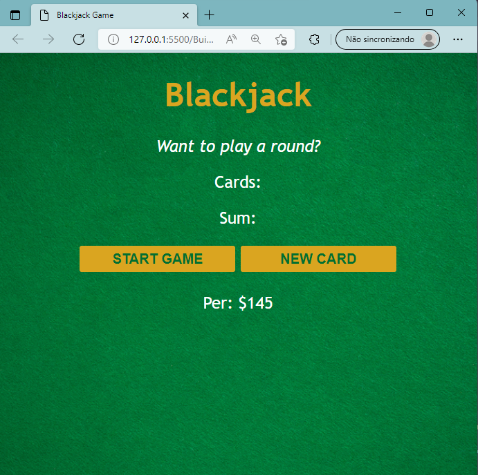

# Blackjack Game 🎲 

- ## Game of the 21

- ## Pratices of the DOM 

## Translate:

- ## Jogo do 21

- ## Práticas do DOM

  - ## O DOM é a manipulação do HTML e CSS com JavaScript  
  
# Imagem do Jogo concluido:

    

