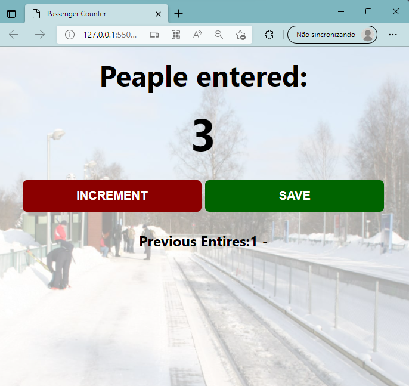

# Passenger Counter

- ## Explenatory Name 
  
## Translate:  

- ## Nome explicativo

- ## Um sistema para contar os passageiros de uma estação de trém e salvar alguns deles

## Foto do projeto:

    

